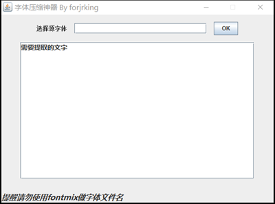

# 字体压缩神器
用于提取仅需要的美化文字，来压缩assets下的字体文件大小。
### 使用说明：
 * 先提取需要特殊字体美化的文字，
 * 把字体和jar包放在同目录下，按下Shift再点击鼠标右键，此处打开命令窗口，输入下面命令 

	    java -jar sfnttool.jar -s '此处放入需要提取的文字' font.ttf fontc.ttf 
    	font.ttf ------ 原字体文件名
    	fontc.ttf------ 提取后的字体文件名
	

经过测试，已经把公司项目，UI提供的***5MB***的艺术字体，提取了仅需要的文字后，体积只有***20KB***，并且可以正常使用。大大压缩了apk包的大小，还可以减小资源加载的占用。有此需要的同学赶紧用起来吧。

### 征求完善 GUI

工具包中已经提供了，反编译工具。有会GUI的研究下源码做出如下界面这个工具就会更加完美了。

